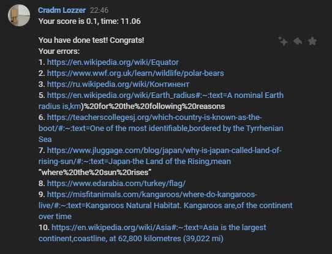

### What is it?

Homework bot


## How to use it

В самом начале бот присылает некоторе команды, которые пользователь может использовать. Наряду с обыкновенными функциями, разобранными в уроке, например предсказание погоды(weather ...) в боте есть реализация прохождения тестов(tests). После входа в "Тесты" пользователь должен ввести свое имя. После прохождния аворизации пользователь попадет в "главное меню". Тут есть возможность выбора тестов кнопками(пока 3 теста по 10 вопросов). Кроме этого, просмотр профиля и статистики, получаемые соответствующими кнопками. Что же происходит в тестах? Сейчас в  тестах каждым сообщением присылается вопрос и 4 инлайн кнопки с выбором ответа. Для каждого прохождения в таблицу записывается точность и время. Более того, после прохождения теста пользователю указывают на его ошибки и присылают ссылку на источник с информацией, которую стоит подтянуть




Статистика пока реализована как график траекторий по каждому тесту. Так как все данные хранятся в таблице, новое представление данных(фукции) пишутся очень быстро

 

## Test structure

PA - possible answer
AA - actual answer

```
Name
Desription
Q1
...
Q10
PA1.1 PA1.2 PA1.3 PA1.4
...
PA10.1 PA10.2 PA10.3 PA10.4
AA1 AA2 ... AA10
link1
...
link10
$
Name
Desription
...
```


example: [example](data/tests.text)